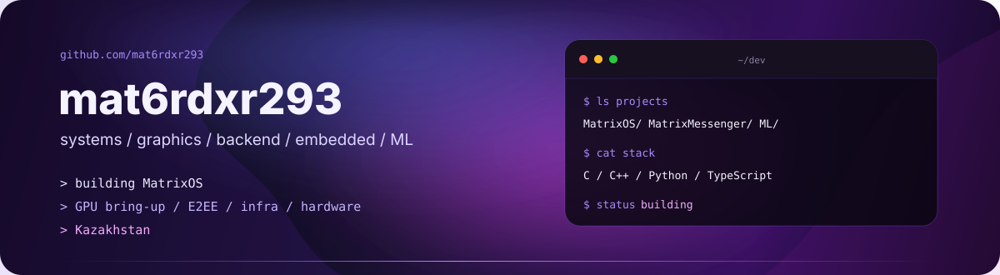

  

  
  
  

  I mostly work below the UI layer: operating systems, graphics, backend infrastructure, cryptography, embedded hardware and small ML experiments.

---

## Hackathons & awards

<table>
<tr>
<td width="50%" valign="top">

### 🥉 AIS Hackathon — 3rd place

Built and shipped a working project under hackathon constraints and finished **3rd**.

`3rd place` `hackathon` `product build`

</td>
<td width="50%" valign="top">

### 🌍 InfoCheck · Goethe-Institut — Tashkent

Participant in the **international InfoCheck hackathon by Goethe-Institut in Tashkent**.

The project became **MatrixEducation** — a school platform with role-based access, analytics, scheduling, BilimClass integration and an AI fallback chain.

<a href="https://github.com/mat6rdxr293/MatrixHackathon-goethe"><b>hackathon project →</b></a>

</td>
</tr>
</table>

  
  
  

---

## Current work

<table>
<tr>
<td width="50%" valign="top">

### `01` MatrixOS

An operating system I'm building from scratch. The current bottleneck is graphics and hardware support, so most of the work is around GPU bring-up rather than polishing a desktop shell.

`C` `C++` `NVIDIA Ampere` `OpenGL` `Vulkan` `USB/HID`

**now:** graphics stack + real hardware  
**repo:** private while the low-level parts are moving fast

</td>
<td width="50%" valign="top">

### `02` MatrixMessenger

Messenger with my own E2EE implementation. The interesting part is the protocol: key exchange, ratcheting and keeping the backend out of the plaintext path.

`Python` `FastAPI` `X25519` `Double Ratchet` `SQLAlchemy`

**now:** protocol/backend work  
**repo:** private

</td>
</tr>
<tr>
<td width="50%" valign="top">

### `03` Small LLMs

I train compact transformer models on consumer hardware to understand the full pipeline instead of only calling an API.

`PyTorch` `GQA` `RoPE` `QK-Norm` `BF16` `tokenizers`

**current scale:** ~135M parameters

</td>
<td width="50%" valign="top">

### `04` Embedded / hardware

ESP32 projects, control electronics, Bluetooth, sensors, PCB experiments and soldering. I like projects where software eventually has to interact with something physical.

`ESP32` `Bluetooth` `electronics` `prototyping`

</td>
</tr>
</table>

---

## Public projects

<table>
<tr>
<td width="50%" valign="top">

### [MatrixEducation](https://github.com/mat6rdxr293/MatrixHackathon-goethe)

School platform built for a hackathon: role-based accounts, analytics, scheduling, achievements, notifications, BilimClass integration and an AI fallback chain.

`React` `TypeScript` `Node.js` `Express`

<a href="https://github.com/mat6rdxr293/MatrixHackathon-goethe"><b>repository →</b></a>

</td>
<td width="50%" valign="top">

### [Aqbobek Lyceum Portal](https://github.com/mat6rdxr293/AqbobekHachathonMatrixAI)

Another school-platform prototype with dashboards, academic analytics, smart scheduling, AI features and kiosk mode.

`React` `TypeScript` `Node.js` `Express`

<a href="https://github.com/mat6rdxr293/AqbobekHachathonMatrixAI"><b>repository →</b></a>

</td>
</tr>
<tr>
<td width="50%" valign="top">

### [hackathon-offline](https://github.com/mat6rdxr293/hackathon-offline)

One of my public hackathon builds. I use hackathons mostly as an excuse to ship something complete under a hard deadline.

<a href="https://github.com/mat6rdxr293/hackathon-offline"><b>repository →</b></a>

</td>
<td width="50%" valign="top">

### [sniperos](https://github.com/mat6rdxr293/sniperos)

An older OS-related repository from before MatrixOS. Keeping it public as part of the path that got me deeper into low-level development.

<a href="https://github.com/mat6rdxr293/sniperos"><b>repository →</b></a>

</td>
</tr>
</table>

---

## Stack

  

<table>
<tr>
<td width="25%" valign="top"><b>Systems</b> C · C++ Linux internals CMake OpenGL · Vulkan</td>
<td width="25%" valign="top"><b>Backend</b> Python · FastAPI Node.js PostgreSQL Redis · Docker</td>
<td width="25%" valign="top"><b>Frontend</b> TypeScript React Vite when the project needs it</td>
<td width="25%" valign="top"><b>Hardware / ML</b> ESP32 electronics PyTorch transformers</td>
</tr>
</table>

---

## More milestones

<table>
<tr>
<td align="center" width="50%">

### ~135M
**parameters**  
current LLM experiments

</td>
<td align="center" width="50%">

### self-hosted
**Linux infrastructure**  
servers · networking · services

</td>
</tr>
</table>

Other things I spend time on: networking, cryptography, GPU internals and electronics.

---

## GitHub

  
  

  

  Most of the low-level work I'm doing right now is private until it stops changing every five minutes.

