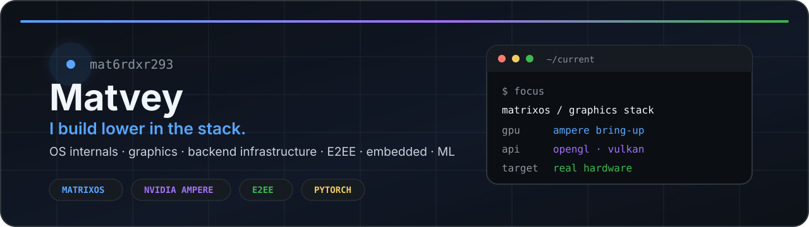
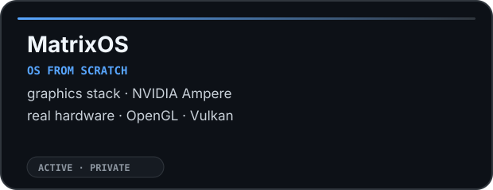
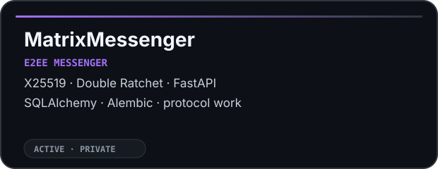
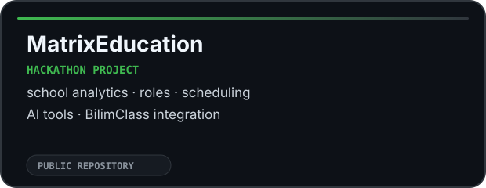
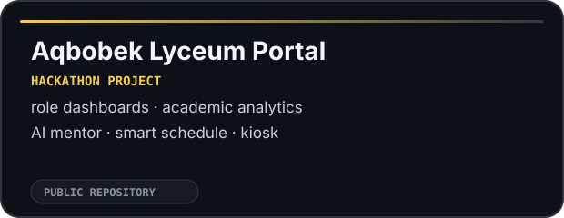
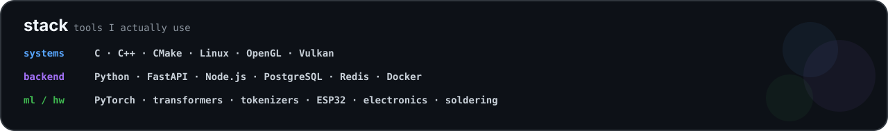

  

 

## Current work

  
  

  
  

 

  

 

## About

I mostly work on projects where the interesting part is under the surface: an OS graphics path, an encryption protocol, backend infrastructure, embedded hardware, or a small model trained on hardware that was not really meant for it.

Right now most of my time goes into **MatrixOS** — getting the graphics stack further on real hardware, including NVIDIA Ampere bring-up and the path toward OpenGL/Vulkan support.

I also build regular product stuff when it makes sense. The two public hackathon projects above are examples of that: full-stack school platforms with analytics, role-based interfaces and AI features.

## Things worth mentioning

- 🥉 3rd place at **AIS Hackathon**
- 🌍 Participant in the **InfoCheck international hackathon by Goethe-Institut, Tashkent**
- 🔐 Implemented an **E2EE protocol** for my messenger project
- 🖥️ Building an **operating system from scratch**
- 🤖 Training compact transformer models on consumer hardware
- 🔧 Comfortable with both software and electronics

 

  <a href="https://github.com/mat6rdxr293?tab=repositories"><b>repositories</b></a>
  &nbsp;·&nbsp;
  <a href="https://github.com/mat6rdxr293/MatrixHackathon-goethe"><b>MatrixEducation</b></a>
  &nbsp;·&nbsp;
  <a href="https://github.com/mat6rdxr293/AqbobekHachathonMatrixAI"><b>Aqbobek Portal</b></a>

  No remote README generators. The visuals above live in this repository.

