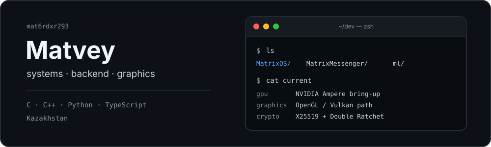

  

I mostly write backend and low-level code. Right now the main project is **MatrixOS**; besides that I maintain an encrypted messenger, mess with small language models and build embedded stuff.

## Projects

<table>
<tr>
<td width="50%" valign="top">

### MatrixOS

Operating system from scratch. Most of the work right now is around the graphics stack: NVIDIA Ampere bring-up, real hardware support, USB/HID and the groundwork for OpenGL/Vulkan.

Private while the internals are changing quickly.

</td>
<td width="50%" valign="top">

### MatrixMessenger

Messenger with an E2EE implementation based on X25519 and Double Ratchet. Backend: FastAPI, SQLAlchemy and Alembic.

Private for now.

</td>
</tr>
<tr>
<td width="50%" valign="top">

### [MatrixEducation](https://github.com/mat6rdxr293/MatrixHackathon-goethe)

Hackathon school platform with role-based access, analytics, scheduling, BilimClass integration and a local-LLM fallback.

`React` `TypeScript` `Node.js` `Express`

</td>
<td width="50%" valign="top">

### [Aqbobek Lyceum Portal](https://github.com/mat6rdxr293/AqbobekHachathonMatrixAI)

School-platform prototype with dashboards, academic analytics, scheduling, AI features and kiosk mode.

`React` `TypeScript` `Node.js` `Express`

</td>
</tr>
</table>

## Stack

| | |
| --- | --- |
| **Languages** | C, C++, Python, TypeScript, JavaScript, Java |
| **Backend** | FastAPI, Node.js, PostgreSQL, Redis, Docker |
| **Systems / graphics** | Linux, CMake, OpenGL, Vulkan |
| **ML** | PyTorch, transformer training / inference |
| **Hardware** | ESP32, electronics, soldering |

## Other

- 3rd place at **AIS Hackathon**
- Participated in the **InfoCheck international hackathon by Goethe-Institut** in Tashkent
- Implemented the E2EE protocol used in MatrixMessenger
- Train compact transformer models on consumer hardware; current experiments are around **135M parameters**
- Run my own Linux servers and self-hosted infrastructure

[repositories](https://github.com/mat6rdxr293?tab=repositories)
